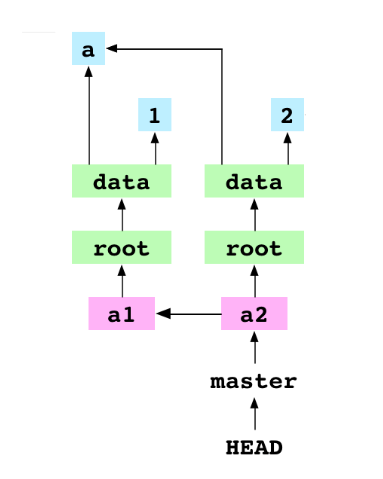

TAGS:: #git 
STATUS:: [[ongoing]] 
CREATED:: [[12th Apr 2026]]

- ### source
	- [Git: inside-out](https://maryrosecook.com/blog/post/git-from-the-inside-out)
- # Initialize the repository
	- It creates a .git directory and writes some files to it. ==THE USER CAN EDIT THE HISTORY OF THE PROJECT JUST LIKE THE FILES==
	- ## Terms
		- **index** : contains a list of all the files that git has every been asked to track.
		- **refs**: Usually stores all the names of the branches that we are using
		- **head**: the HEAD pointer, which usually has the master folder nested in it.
		-
	- ## Add some files
		- Git add has two effects:
			- it creates a new blob file in the .git/objects/ directory -- the compressed content of the letter.txt file
				- It creates a hash for the text. The first two letter are used as the name of the directory- the rest for the content of the file -- like a unique fingerprint.
				- Even if a user deletes the file its content would be safe in the .git folder.
			- It also adds file to the index. It is stored as a file at .git/index. Each line of the file maps a tracked file to the hash of its content. A <name> -> <hash> map for ease of access.
-
	- ## Committing files
		- Blobs are stored by ==git add== but trees are stored when a commit is made. A tree represents a tree in the working directory.
		- Elements of the tree object that records the content of the data directory:
			- TODO Permission Codes: What sort of permissions we have regarding the file\
			  logseq.order-list-type:: number
			- Keyword: whether something is a blob or a tree
			  logseq.order-list-type:: number
			- Hash: The unique hash identifying the version of the file 
			  logseq.order-list-type:: number
			- Name: The name of the file.
			  logseq.order-list-type:: number
		- Git commit creates a commit object after creating the tree graph.
		- So the idea is that the HEAD pointer points to the latest commit, which then points to the head of the root graph.
			- The root-graph is also stored as an object. But whether it is a blob or tree is encoded in the hash itself.
			- ==There are no folders just a collection of hashes pointing at objects==
			- ```bash
			  //how trees are stored
			  <mode> <folder-name> \0 <linking hash>
			  //the \0 is the seperator
			  //this in turn is stored via hashing 
			  tree <file-size> <all entries>
			  //this is why git can figure out when we do git cat-file -p,-t,-s and all these flags 
			  ```
		- When you commit a change a new blob of the file is created to reflect the change.
			- A new commit object is created -- with the commit hash of the current and the parent. The parent can be found by a simple traversal of the head pointer to the ref and then to the commit.
			- Then the idea is we move both the pointers to the new commit -- to reflect the current state of the repo.
			-  
			  **An interesting point to note is how it reuses the blobs which have not been change.d Making memory use highly efficient**
		- We should use git tag more often. Although the description is fine and the hash is easy to copy still.
	- ## Checking out of a branch
		- **First** : We find the particular hash -- which has its own file tree
		- **Second**: Then we update the working directory
		- **Third**: We update the index -- why? ==So that we don't end up updating or committing the wrong thing==
			- Git enforces the rule that the index(where staged changes are) == working directory.
		- Fourth: The content of the HEAD is moved directly to the hash of the checkout.
		- ==The problem with the detached head state and why it can cause loss of data is simple. Garbage cleaning of git. It cleans commits that are unreachable by some refs. Refs are just what we attach a particular lineage of changes==
		-
- # Merging in git
	- It is an 8 step process:
		- logseq.order-list-type:: number
	-