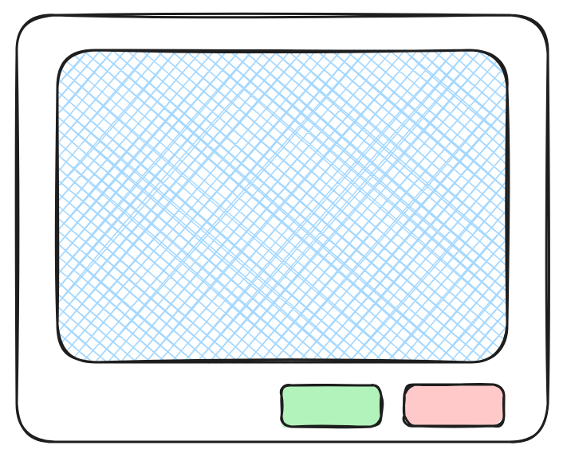

TAGS:: #aceCloud 
STATUS:: [[ongoing]] 
CREATED:: [[9th Apr 2026]]

-
- # Requirements
	- **Notification Bell Icon**: at the top of the nav bar
	- A drop down that reveals the top 5 notifications of the user
		- At the bottom it would have an option to view all notification
	- **View All Notification** : This would be a modal with infinite scroll. Points to consider: ==ReactJS: fixed-size-list==
		- This would have a modal - infinite scroll modal.
		- Three chips/status icons for the notification: Accepted, Rejected, Unread, Opened but no decision.
		- The modal would have a close button as well
		- Search functionality along with filter for easily persual
-
	- **Approve Notification** : This modal would open when a user clicks on a particular notification.
		- Modal Detail page: Would have the details of all the relevant parameters of the request -- who it was accepted by resource etc.
		- Approval/Rejection button at the bottom.
		- Toast for notifications
-
	- ### Packages installed
		- @microsoft/fetch-event-source: For SSE with auth headers
		- react-window: for virtualization
		- react-window-infinite-loader: for infinite scroll
-
- # UI Ideas/concepts
	- {:height 393, :width 378} ==Modal  window for approval==
	- I think for the rest I would have to us the chip from the existing UI only.
- ## Improvements
	- Button for approval and denial should be visible
	- The detail section should be well formatted.
		- I don't need the endpoint but rather the relevant details such as registry name, vulnerability scanning etc. properly formatted.
		- Check whether we are updating the state or not
		- Failed notification filter
		- Why the redundancy in notifications? if only 2 notifications are fetched. check.
	- ==Component: Your request has been submitted. how would we resolve conflicts?==
	- Stream permission check: everyone should have the permission to view read unread notifications. Only approve notification permission is with admin.
	- Toast not there on the user end -- could be majorly a permission based issue
	- If a request has been acted upon -- like something: then we should change the state from pending to whatever the action was taken.
		- So the filter would be unread, approved, rejected, pending -- where no action has been taken -- but on action we need to update.
-
- ## Things to check
	- The update logic of the
- # Backend Architecture
- The details, edge cases is linked in [[ace-notification: backend]]