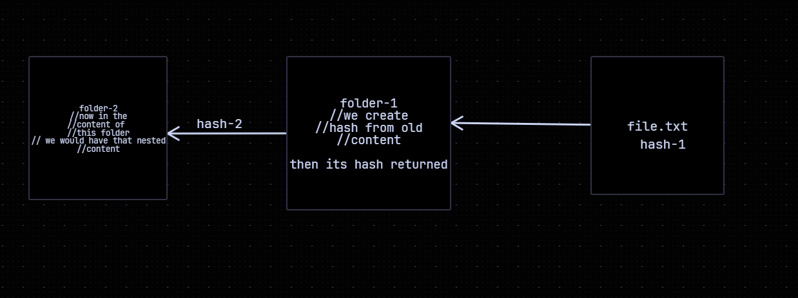

TAGS:: #Git. #Project
STATUS:: [[ongoing]] 
CREATED:: [[19th Apr 2026]]

- # Overview
	- the project aims to create a version control system in type script. I would want to log the basic code patterns and what each file is responsible for doing and then updating the same accordingly
	- ## util.ts
	  collapsed:: true
		- Contains all the major helpers.
		- ### setIn
			- ```javascript
			  //the idea is to convert a standard flat object into nested one provided the path is given
			  //something along the lines of creating a nested object with flat file-file-hash idea.
			  function setIn(result,path)=>{
			    if(path.length==2){
			      obj[path[0]]=path[1];
			    }
			    //otherwise it is a nested object
			    obj[path[0]] = setIn(obj[path[0]] ?? {}, path.slice(1) as any);
			    //why slice? so that we move to the next
			  }
			  ```
-
	- ## file.ts
	  collapsed:: true
		- Contains file reading and writing functions
		- ### repoRoot
			- A traversal function to find the root of the repo. We initialize git at the very base for VCS and this act as a de-facto checking layer.
			- And we check till the very end. -- ie the root of the computer
			- ```javascript
			  //repo root function
			  function repoRoot()=>{
			    let current = process.cwd();
			    
			    while(current!=path.dirname(current)){
			      if(fs.existsSync(path.join(current,".tsgit"))) return current
			      
			      current = path.dirname(current);
			    }
			    
			    return undefined;
			    
			  }
			  ```
			- ==PATH==: a special NodeJS modular object that allows for callable function that can tell where the file is located, the appropriate extensions.
			-
		- ### tsGitPath
			- Takes an array of elements and returns the relevant path in the git folder. A simple abstracted layer
		- ### lsRecursive
			- Returns full paths. The key functions is readdirSync
			- ```javascript
			  const lsRecursive= (dirPath:string):string[]=>{
			    //the idea is simple we run it -- and check fs.isFile();
			    let results: string[] = [];
			    
			    fs.readdirSync(dirPath,{withFileType:true}).forEach((it)=>{
			      if(it.isFile()){
			        results.push(fullPath);
			      }
			      
			      else{
			        results.push(...lsRecursive(it));
			      }
			    })
			    return results;
			  }
			  ```
	- ## config.ts
	  collapsed:: true
		- The main challenge was that config is stored in the INI format, [] -- for headings, and then key=value pair for storing the information
		- We convert it into strings so that we can write it into our configs.
		- The regex matching is the hard part although it also uses our de-facto setIn function.
		- Nesting of objects via a particular path so we pass accordingly.
		- core
	- ## object.ts
	  collapsed:: true
		- ### writeObject
			- ```javascript
			  //the idea is quite simple here
			  //we hash the content using sha-1
			  //we take the hash and slice the first 2 character
			  //form the dir, write the content and return hash
			  const writeObject=(content:string):string =>{
			    //generating hash
			    const hashObj = hash(content);
			    const objDir = hashObj.slice(0,2);
			    const fileDir = hashObj.slice(2);
			    const objFile = tsGitPath('objects',objDir,fileName);
			    write(objFile,content);
			    return hashCon;
			  }
			  ```
		- ### writeTree
			- ```javascript
			  //again the idea is simple -- we get a record tree. And all that we have to do is check whether something is a string or not
			  //because if it is not a string then it is a tree which would ultimately further reference other tree -- now think how do we find it?
			  //we keep going -- we return the hash of the blob file -- and we end up writing in the end -- writeObj writing to the appropriate entries 
			  //adding a white-board drawing to make it clearer
			  
			  ```
			- 
	- ## refs.ts
	  collapsed:: true
		- This file is majorly for the branch name i.e. aliases that exist.
		- Majorly we deploy 2 types of function: terminalRef, and the one used to return the hash
		- ### terminalRef
			- ```javascript
			  export const terminalRef = (ref:string)=>{
			    //get the gitPath
			    const refPath = tsGitPath(ref);
			    let content = read(refPath);
			    if(content.startsWith("ref: ")){
			      return terminalRef(content.replace("ref: ","").trim());
			    }
			    returns hash
			  }
			  ```
		- ### hash
			- ```javascript
			  //just a thin helper for early matching and non existing refs
			  //the hash function -- if it detects it is a hash would return early
			  //interesting regex tho
			  /^[0-9a-f]{40}/ -- regex for sha1 hash matching
			  ```
	- ## index.ts
	  collapsed:: true
		- The main function here is the workingCopytoc: working copy of table of contents which would tell you the current state of the repo and help you run your diff commands.
		- The idea is simple: you get files from ls recursive. You form the relative path, you split with \\ and then join
		- ```javascript
		  export const workingCopyToc = ()=>{
		    const files = lsRecursive(workingDir());
		    
		    files.forEach((file)=>{
		      let relativePath = path.relative(workingDir,file).split("//").join("/");
		      result[relativePath] = hash(read(file));
		    })
		  }
		  ```
	- ## ts_git.ts
	  collapsed:: true
		- ### commit
			- A critical function is ofc commit which is done in the following steps:
				- readIndex(): you see the current state of the staged files and you read the index file
				  logseq.order-list-type:: number
				- createTree(): recursively making a chain of working tree.
				  logseq.order-list-type:: number
				- terminalRef(): finding the commit that head is pointing to.
				  logseq.order-list-type:: number
			- The critical aspect to keep in mind is the idea that at any point ref just points to one Commit. It is the commit object that allows the formation of chain of commits.
		- ### log()
			- Now we have the log function which is a recursive algo -- traversing like linked list. Nothing special.
		- ### head
			- Here the idea is that it is a single file as per usual which usually has the ref/ in non detached head mode, and a normal commit hash in detached head mode.